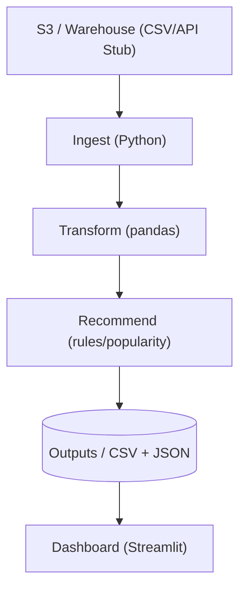
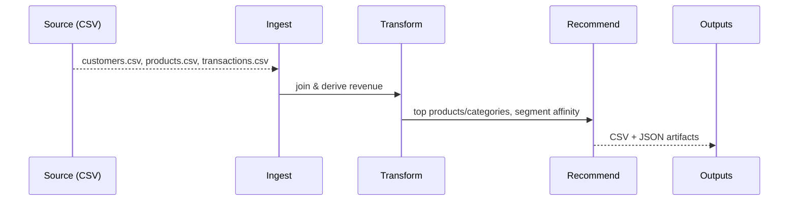
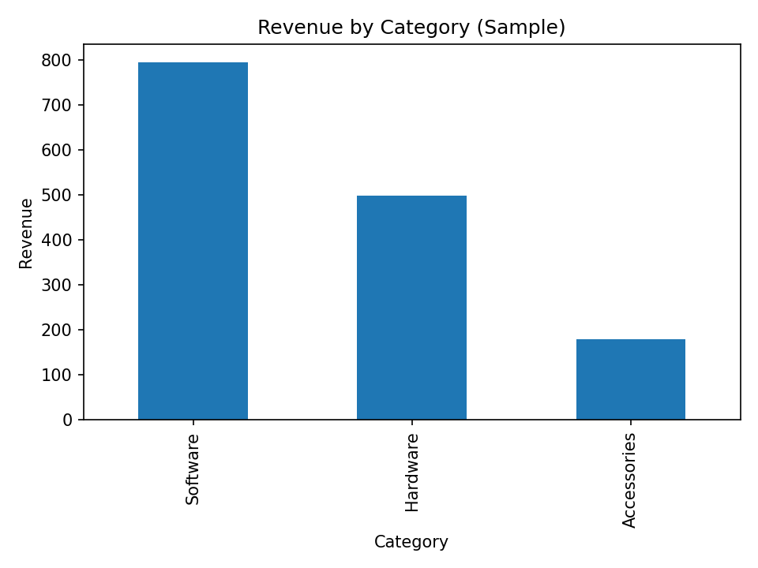

# 🛍️ Customer Analytics & Recommendation Platform

Completed project that ingests customer & transaction data, computes KPIs, and produces **naive recommendations** (popularity & segment affinity). Clean DE structure, diagrams, and a dashboard image.

---

## 🧱 Architecture (Mermaid)


## 🔁 Data Flow (Mermaid)


---

## ✨ Features
- 📦 Unified enriched dataset (customers × products × transactions)
- 📊 KPIs: revenue by segment & category, top products
- 🤖 Naive recommendations: popularity + segment top-category
- 🧱 Production-style layout; easy to extend to dbt/Airflow/Redshift/S3

---

## 🧰 Tech Stack
| Layer | Tech |
|---|---|
| Ingest | Python (CSV/API stub) |
| Processing | Python (pandas) |
| Recs | Rules/Popularity (JSON outputs) |
| Storage | CSV/JSON (local demo) |
| Viz | Streamlit (screenshot) |

---

## 🚀 How to Run (Local)
```bash
pip install -r requirements.txt
python src/ingest/ingest_local.py
python src/transform/transform_metrics.py
python src/recommend/recommend_basic.py
# optional dashboard
streamlit run dashboards/app.py
```

---

## 📊 Results (Sample)
- **Customers:** **4**
- **Transactions:** **7**
- **Revenue:** **$1,474.92**



---

## 📁 Structure
```
customer-analytics-recommendation-platform/
├─ src/
│  ├─ ingest/ingest_local.py
│  ├─ transform/transform_metrics.py
│  ├─ recommend/recommend_basic.py
│  └─ load/ (optional)
├─ data/
│  ├─ raw/{customers,products,transactions}.csv
│  └─ processed/
├─ dashboards/app.py
├─ docs/
├─ sql/
├─ requirements.txt
└─ README.md
```

---

## 🏁 Status
**Completed** demo with runnable ingest/transform/recommend, KPIs, diagrams, and dashboard image.

